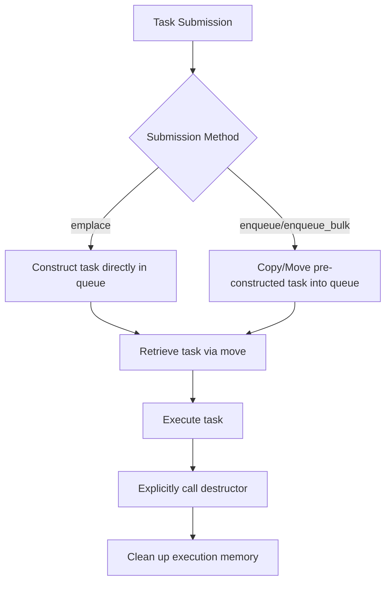
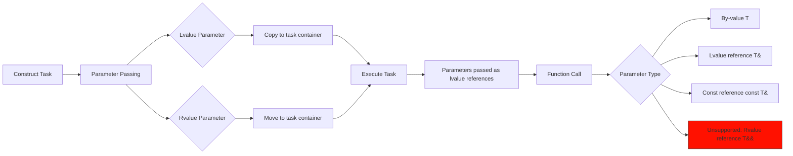

# HSLL::LFThreadPool

## Overview

This is a lightweight C++11 thread pool implementation that **requires only header files** to use.

Its core advantages lie in **efficiency and flexibility**:
*   **Avoids dynamic memory allocation:** Uses stack-based pre-allocated task containers to store tasks and their parameters directly on the stack.
*   **Multiple submission methods:** Supports submitting single tasks or batches of tasks to meet different scenario requirements.
*   **Intelligent load balancing:** Combines Round-Robin scheduling, secondary queue selection, and work-stealing mechanisms to effectively distribute workload.
*   **Resource optimization:** Dynamically adjusts the number of active threads based on current load, reducing unnecessary memory usage.
*   **Graceful shutdown:** Provides two shutdown modes: immediate shutdown or waiting for all tasks to complete before shutting down.

## Integration
```cpp
// Ensure the 'basic' folder is in the same directory
#include "ThreadPool.hpp"
```

## ThreadPool Class Template

### Template Parameters
```cpp
template <class TYPE = TaskStack<>>
class ThreadPool
```
- `TYPE`: Stack-based pre-allocated task container (see TaskStack.md documentation for details)

### Initialization Method
```cpp
bool init(unsigned int queueLength, unsigned int minThreadNum,
            unsigned int maxThreadNum, unsigned int batchSize = 1,
            std::chrono::milliseconds adjustInterval = std::chrono::milliseconds(3000))
```
- **Parameters**:
  - `queueLength`: Capacity of each work queue
  - `minThreadNum`: Minimum number of worker threads
  - `maxThreadNum`: Maximum number of worker threads
  - `batchSize`: Number of tasks processed in a single batch
  - `adjustInterval`: Interval for dynamic adjustment of active thread count
- **Return value**: Returns true if initialization is successful
- **Function**: Allocates resources and starts worker threads (initial count equals maxThreadNum)

### Shutdown Method
```cpp
void exit(bool shutdownPolicy = true)
```
- `shutdownPolicy`: 
  - true: Graceful shutdown (executes remaining tasks in the queue)
  - false: Immediate shutdown

## Task Submission Interfaces

| Method Type      | Interface     |
|-------------|------------|
| Single task submission    | emplace    | 
| Pre-constructed task   | enqueue     | 
| Bulk tasks     | enqueue_bulk| 

## Basic Usage
```cpp
#include "ThreadPool.hpp"

using namespace HSLL;
using Type = TaskStack<64,8>; // Task container with max size 64 bytes, max alignment 8

void Func(int a, double b) { /*...*/ }

int main()
{
    // Create thread pool instance with task container type Type
    ThreadPool<Type> pool;

    // Initialize thread pool: queue capacity 1000, min threads 1, max threads 4
    pool.init(1000, 1, 4); 

    // Add task - basic example
    Type task(Func, 42, 3.14);
    pool.enqueue(task);

    // Add task - in-place construction
    pool.emplace(Func, 42, 3.14); // Avoids temporary object construction vs enqueue

    // Add task - std::function
    std::function<void(int,int)> func(Func);
    pool.emplace(f,42,3.14);

    // Add task - lambda
    pool.enqueue([](int a,int b){});

    // exit(false) is automatically called on pool destruction, 
    // but manual call is recommended to control shutdown behavior
    pool.exit(true); // Graceful shutdown. Can reinitialize via init() later

    return 0;
}
```
**See example files for additional usage patterns**

## Task Lifecycle


## Parameter Passing Process


## Important Notes
1. **Type Matching**: Submitted task types MUST exactly match the queue's task type
2. **Alignment Requirements**: Task max alignment MUST be ≤ queue task type's alignment
3. **Exception Safety**:
   - NO exceptions allowed during enqueue operations
   - `emplace` interfaces require task (parameter/copy/move) constructions to be noexcept
   - Other interfaces require task (copy/move) constructions to be noexcept
   - `execute()` MUST NOT throw - catch and handle all possible exceptions within tasks
     
**Unlike heap-allocated tasks, copying stack-allocated tasks can fail. Since exceptions from asynchronously executed stack tasks cannot propagate to the caller, strict exception guarantees are a necessary compromise for stack-based task storage.**

## Platform Support
- Linux (aligned_alloc)
- Windows (aligned_malloc)
- C++11 or newer standard

## Project Structure

- 📂 document--------------------Documentation
- 📂 example---------------------Usage examples
- 📂 include---------------------Include directory
- 📂 perf_test-------------------Performance tests
- 📂 single_header_version-------Single-header version
- 📄 README.md-------------------Chinese project documentation
- 📄 README.en.md----------------English project documentation

Here is the translation:

## Other

This is a version where the current queue has been replaced with `moodycamel::ConcurrentQueue`, demonstrating significantly improved performance:  
[LFThreadPool2](https://github.com/HSLL175848494/LFThreadPool2)